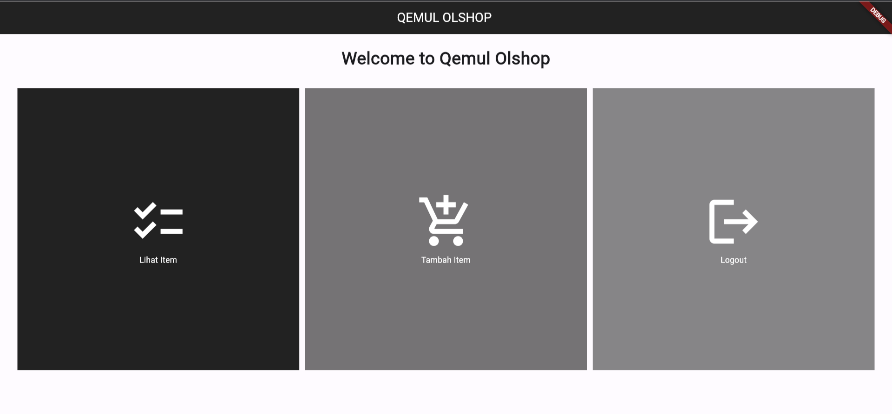

# TUGAS 7 PBP
## A. Stateless vs Statefull
Di dalam pengembangan aplikasi Flutter, terdapat dua jenis widget utama: stateless widget dan stateful widget. Perbedaan utama antara keduanya adalah bagaimana mereka mengelola dan merender perubahan pada tampilan aplikasi. Berikut adalah penjelasan perbedaan utama antara keduanya:

- Stateless Widget:
   - Stateless widget adalah widget yang tidak memiliki keadaan internal (state). Artinya, sekali dibangun, tampilan widget ini tidak berubah selama masa hidupnya. Contoh penggunaannya adalah untuk elemen-elemen yang bersifat statis, seperti teks atau ikon.
   - Stateless widget diimplementasikan dengan kelas yang mewarisi StatelessWidget. Kita hanya perlu mengeset properti dan konfigurasi widget di dalam konstruktor, dan tampilan widget tersebut akan tetap sama selama masa hidupnya.

- Stateful Widget:
   - Stateful widget adalah widget yang dapat mengubah tampilan mereka selama masa hidupnya. Mereka memiliki keadaan internal (state) yang dapat diperbarui, dan ketika keadaan berubah, widget akan di-rebuild untuk mencerminkan perubahan tersebut. Contoh penggunaannya adalah untuk elemen-elemen yang memerlukan interaksi pengguna, seperti formulir atau daftar item yang dapat dihapus.
   - Stateful widget diimplementasikan dengan dua kelas: kelas utama yang mewarisi StatefulWidget dan kelas state yang mewarisi State. Keadaan (state) dikelola dalam kelas state, dan perubahan pada state memicu pembaruan widget.

Untuk mengimplementasikan perbedaan ini dalam Flutter, Kita dapat menggunakan widget berikut:

StatelessWidget (untuk stateless widget):
   ```dart
   class MyStatelessWidget extends StatelessWidget {
     final String text;

     MyStatelessWidget(this.text);

     @override
     Widget build(BuildContext context) {
       return Text(text);
     }
   }
   ```

StatefulWidget (untuk stateful widget):
   ```dart
   class MyStatefulWidget extends StatefulWidget {
     @override
     _MyStatefulWidgetState createState() => _MyStatefulWidgetState();
   }

   class _MyStatefulWidgetState extends State<MyStatefulWidget> {
     int counter = 0;

     void incrementCounter() {
       setState(() {
         counter++;
       });
     }

     @override
     Widget build(BuildContext context) {
       return Column(
         children: [
           Text('Counter: $counter'),
           ElevatedButton(
             onPressed: incrementCounter,
             child: Text('Increment'),
           ),
         ],
       );
     }
   }
   ```
## B. Widget dan Fungsi
Pada awal mulanya, `MyHomePage` adalah __stateless widget__ yang digunakan untuk membuat tampilan utama dengan daftar item. Setiap item direpresentasikan oleh `ShopItem` dan diteruskan ke `ShopCard` untuk ditampilkan sebagai kartu dengan ikon dan teks yang sesuai. Ketika salah satu kartu diklik, akan muncul `SnackBar` yang memberi tahu pengguna tombol apa yang mereka tekan.

Berikut adalah daftar widget yang digunakan beserta penjelasan fungsinya:

1. `MaterialApp`: Ini adalah widget utama yang digunakan untuk menginisialisasi aplikasi Flutter. Ia mengatur tema dan berisi halaman beranda aplikasi.

2. `Scaffold`: Scaffold adalah kerangka kerja dasar yang digunakan untuk membuat tampilan dasar aplikasi, termasuk AppBar dan area konten utama.

3. `AppBar`: Ini adalah bilah atas yang menampilkan judul aplikasi dan latar belakang berwarna hitam.

4. `Center`: Digunakan untuk mengatur kontennya ke tengah secara horizontal dan vertikal.

5. `Text`: Untuk menampilkan teks di dalam AppBar dan tampilan utama. Kita juga mengatur font, warna, dan gaya teks di sini.

6. `SingleChildScrollView`: Ini adalah widget yang memungkinkan kontennya bisa digulir jika terlalu besar untuk layar. Digunakan untuk membungkus konten utama.

7. `Padding`: Digunakan untuk menambahkan jarak antara elemen-elemen dalam tampilan.

8. `Column`: Ini adalah widget yang menampilkan elemen-elemen secara vertikal.

9. `GridView.count`: Widget ini digunakan untuk membuat grid layout dengan jumlah kolom yang diberikan. Kita dapat menambahkan item ke dalam grid ini.

10. `ShopCard`: Ini adalah widget yang Kita buat sendiri untuk menampilkan setiap item dalam grid. Ini termasuk ikon dan teks untuk setiap item.

11. `InkWell`: Digunakan untuk memberikan efek sentuhan saat item di grid diklik. Ini memungkinkan untuk menangani interaksi pengguna.

12. `Icon`: Digunakan untuk menampilkan ikon yang sesuai dengan setiap item.

13. `SnackBar`: Ini adalah widget yang digunakan untuk menampilkan pesan kilat (toast) di bagian bawah layar ketika salah satu item di grid diklik. Ini memberi umpan balik kepada pengguna.

Semua widget ini digunakan untuk membangun tampilan utama aplikasi Kita dan menampilkan daftar item dalam grid dengan respons saat diklik.

## C. Implementasi Checklist
### 1. Membuat sebuah program Flutter baru dengan tema inventory seperti tugas-tugas sebelumnya.

Membuat projek dengan ide yang sama (Online Shop by Kemal) flutter baru di direktori yang diinginkan dengan perintah:
```sh
flutter create qemulshop_app
```

### 2. Membuat tiga tombol sederhana dengan ikon dan teks yang diinginkan.
#### a) Pertama memisahkan main.dart dan menu.dart sesuai intruksi tutorial agar code lebih mudah dibaca.

#### b) Menambahkan kode berikut dalam menu.dart:
```dart
class MyHomePage extends StatelessWidget {
  MyHomePage({Key? key}) : super(key: key);

  final List<ShopItem> items = [
    ShopItem("Lihat Item", Icons.checklist, Colors.black87),
    ShopItem("Tambah Item", Icons.add_shopping_cart, Colors.black54),
    ShopItem("Logout", Icons.logout, Colors.black45),
  ];

  @override
  Widget build(BuildContext context) {
    return Scaffold(
      appBar: AppBar(
        title: const Center(
          child: Text(
            'QEMUL OLSHOP ',
            style: TextStyle(color: Colors.white),
          ),
        ),
        backgroundColor: Colors.black87,
      ),
      body: SingleChildScrollView(
        // Widget wrapper yang dapat discroll
        child: Padding(
          padding: const EdgeInsets.all(10.0), // Set padding dari halaman
          child: Column(
            // Widget untuk menampilkan children secara vertikal
            children: <Widget>[
              const Padding(
                padding: EdgeInsets.only(top: 10.0, bottom: 10.0),
                // Widget Text untuk menampilkan tulisan dengan alignment center dan style yang sesuai
                child: Text(
                  'Welcome to Qemul Olshop ', // Text yang menandakan toko
                  textAlign: TextAlign.center,
                  style: TextStyle(
                    fontSize: 30,
                    fontWeight: FontWeight.bold,
                  ),
                ),
              ),
              // Grid layout
              GridView.count(
                // Container pada card kita.
                primary: true,
                padding: const EdgeInsets.all(20),
                crossAxisSpacing: 10,
                mainAxisSpacing: 10,
                crossAxisCount: 3,
                shrinkWrap: true,
                children: items.map((ShopItem item) {
                  // Iterasi untuk setiap item
                  return ShopCard(item);
                }).toList(),
              ),
            ],
          ),
        ),
      ),
    );
  }
}
```
Dalam kode diatas kita membuat tampilan dasar dalam aplikasi kita dengan widget `Scaffold`, lalu definisikan list button/hal apa yang ingin ditambahkan base on soal yang diminta (Lihat item, add Item, dan Logout).

Lalu membuat app bar kita seperti yang diinginkan dalam Text(QEMUL OLSHOP) ditambah dengan atribut yang diinginkan seperti posisi dan warna dari appbar.

Ditambah denga bagian `body` dari tampilan aplikasi yang dimulai dengan judul Text (Welcome to Qemul Olshop). Lalu setting button-button yang isinya sudah di define sebelumnya.

```dart
class ShopItem {
  final String name;
  final IconData icon;
  final Color color;
  ShopItem(this.name, this.icon, this.color);
}
```
Dalam kode diatas kita membuat class dari `ShopItem` sebagai perantara isi list hal yang dipersiapkan dalam `MyHomePage` dan ditampilkan dalam bentuk `ShopCard`.

```dart
class ShopCard extends StatelessWidget {
  final ShopItem item;

  const ShopCard(this.item, {super.key}); // Constructor

  @override
  Widget build(BuildContext context) {
    return Material(
      color: item.color,
      child: InkWell(
        // Area responsive terhadap sentuhan
        onTap: () {
          // Memunculkan SnackBar ketika diklik
          ScaffoldMessenger.of(context)
            ..hideCurrentSnackBar()
            ..showSnackBar(SnackBar(
                content: Text("Kamu telah menekan tombol ${item.name}!")));
        },
        child: Container(
          // Container untuk menyimpan Icon dan Text
          padding: const EdgeInsets.all(8),
          child: Center(
            child: Column(
              mainAxisAlignment: MainAxisAlignment.center,
              children: [
                Icon(
                  item.icon,
                  color: Colors.white,
                  size: 100.0,
                ),
                const Padding(padding: EdgeInsets.all(3)),
                Text(
                  item.name,
                  textAlign: TextAlign.center,
                  style: const TextStyle(color: Colors.white),
                ),
              ],
            ),
          ),
        ),
      ),
    );
  }
}

``` 
Dalam kode diatas kita menampilkan list yang sudah dibuat dengan bentukan cards dan menampilkan `Snackbar` seperti yang diinginkan dan warna button yang berbeda (bonus).

#### c) Menambahkan kode berikut dalam main.dart:
```dart
import 'package:flutter/material.dart';
import 'package:qemulshop_app/menu.dart';

void main() {
  runApp(const MyApp());
}

class MyApp extends StatelessWidget {
  const MyApp({super.key});

  // This widget is the root of your application.
  @override
  Widget build(BuildContext context) {
    return MaterialApp(
      title: 'Flutter Demo',
      theme: ThemeData(
        colorScheme: ColorScheme.fromSeed(seedColor: Colors.indigo),
        useMaterial3: true,
      ),
      home: MyHomePage(),
    );
  }
}

```
Dalam kode diatas adalah setting awal dalam aplikasi kita yang menampilkan title dari header tampilan, lalu memanggil isi dari tampilan aplikasi kita

Tampilan aplikasi Qemul Olshop (on Browser):
