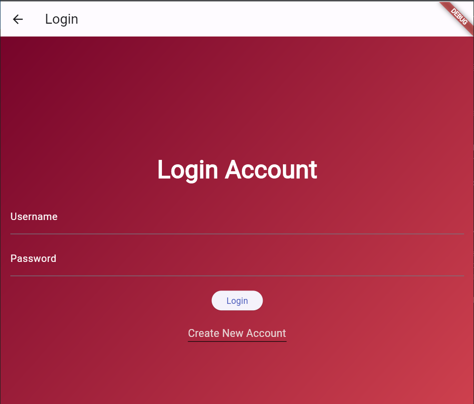
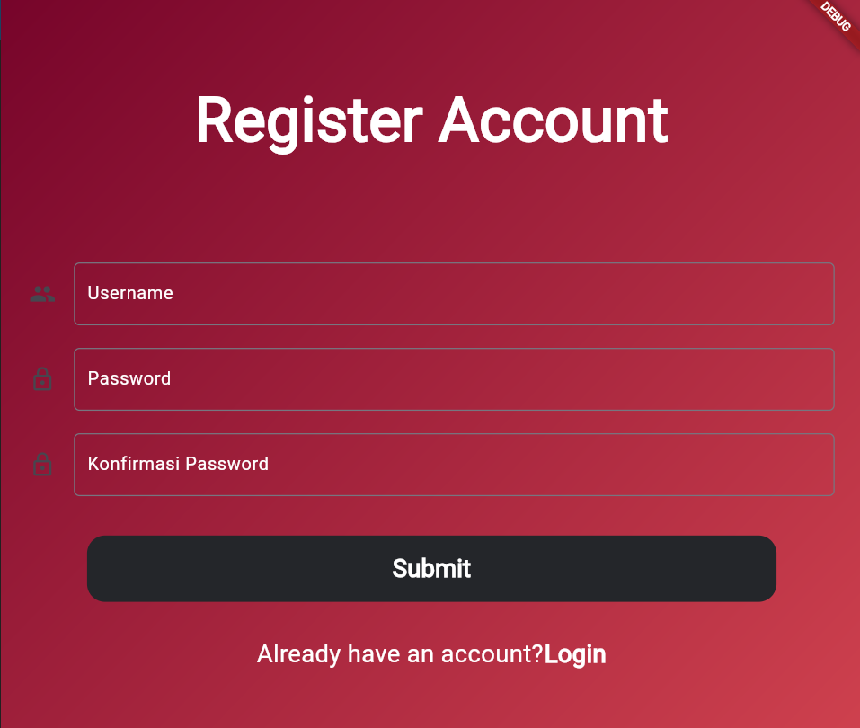
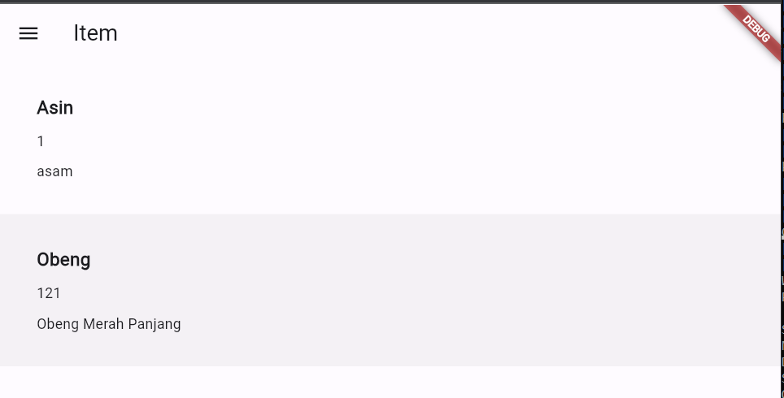
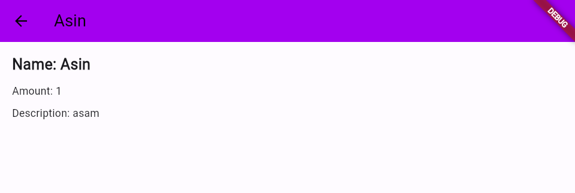
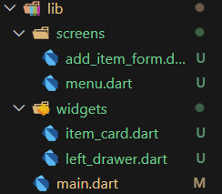

# TUGAS 9 PBP
## A. Pengambilan Data JSON Tanpa Membuat Model Terlebih Dahulu:
Ya, kita dapat melakukan pengambilan data JSON tanpa membuat model terlebih dahulu. Pengambilan data JSON dapat dilakukan menggunakan metode seperti http.get dalam Flutter untuk mengambil data dari API. Namun, menggunakan model seringkali disarankan untuk mempermudah pengelolaan dan parsing data.

## B. Kelebihan dan Kekurangan Penggunaan Model:
- Kelebihan:

  Struktur yang Terorganisir: Model membantu dalam mengorganisir data dengan cara yang terstruktur.
  Validasi Data: Model dapat memvalidasi data sebelum digunakan atau disimpan.
  Kemudahan Pengelolaan Kode: Membuat model memudahkan pembacaan dan pemeliharaan kode.

- Kekurangan:

  Waktu dan Usaha: Membuat model memerlukan waktu dan usaha tambahan.
  Overhead Jika Sederhana: Untuk aplikasi sederhana, membuat model mungkin terlalu berlebihan.

## C. CookieRequest:
Dalam konteks ini, Provider dari Flutter digunakan untuk mengelola state dan menyediakan instance CookieRequest (library dari django) ke seluruh aplikasi. Hal ini memudahkan berbagai bagian aplikasi untuk mengakses dan menggunakan instance CookieRequest tersebut tanpa perlu membuatnya ulang.

Jika CookieRequest berisi informasi yang dibutuhkan untuk berinteraksi dengan server Django, misalnya token atau informasi otentikasi lainnya, maka menyediakan instance ini ke seluruh aplikasi memastikan bahwa informasi otentikasi dapat diakses dengan mudah oleh semua bagian aplikasi yang membutuhkannya.

Namun, pastikan bahwa informasi otentikasi atau data sensitif lainnya yang ada di dalam CookieRequest diatur dan disimpan dengan aman, terutama jika diakses dari berbagai bagian aplikasi yang berbeda. Keamanan dan kepatuhan terhadap praktik terbaik keamanan adalah faktor kunci dalam desain aplikasi.

## D.  Mekanisme Pengambilan Data dari JSON ke Flutter:
1. Kita bikin dulu fungsi-fungsi async di dalam views.py projek django kita.

2. Mengambil Data: Gunakan paket seperti http dan postJson (dipadukan dengan cookies) untuk mengambil data JSON dari API atau endpoint path Json yang sudah dibuat dalam projek django kita.

3. Parsing Data: Gunakan metode seperti json.decode untuk mengubah data JSON menjadi struktur data yang dapat digunakan dalam Flutter, seperti Map atau objek Dart.

## E. Mekanisme Autentikasi antara Flutter dan Django:
1. Input Data Akun di Flutter: Gunakan formulir atau metode input untuk mengumpulkan informasi akun dari pengguna.

2. Buat fungsi login, register (bonus), dan logout dalam app autheticate baru for flutter.

3. Autentikasi ke Django: Kirim data akun ke backend Django melalui permintaan request.login (cookies + funct login dari package) dan lakukan proses autentikasi di login Django.

4. Dari django mengirimkan data json yang dibutuhkan untuk validasi dan input message dalam flutter yang menandakan bahwa login berhasil atau tidak.

## F. Tampilan Menu setelah Autentikasi
1. Dari login kita dikasih Json response berupa status, message, dan username dari login django.

2. Dari status kita dapat membuat kondisi-kondisi yang diinginkan base on hasil status. Kita juga dapat menampilkan message dari hasil olahan fungsi login di views.py Django.

3. Lalu menampilkan MyHomepage sebagai tampilan utama menu dengan menyimpan cookies login dan username yang login dalam static variabel class LoginPage.

## G. Widgets Yang DIpakai:

### 1. File `login.dart`:

#### Widgets:
- **MyApp (StatelessWidget):**
  - **Fungsi:** Widget utama yang menjalankan aplikasi. Menginisialisasi `CookieRequest` dan menyediakannya menggunakan `Provider`. Menampilkan `MaterialApp` dengan tema dan halaman utama (`LoginPage`).

- **LoginPage (StatefulWidget):**
  - **Fungsi:** Halaman utama aplikasi yang menangani proses login.
  - **Controller: ( TextFieldControler )**
    - `_usernameController`: Controller untuk mengelola input teks dari field username.
    - `_passwordController`: Controller untuk mengelola input teks dari field password.
  - **Metode:**
    - `build`: Membuat antarmuka pengguna untuk halaman login.
    - `_login`: Metode yang dipanggil saat tombol login ditekan untuk memproses informasi login.
  - **Widget UI:**
    - `AppBar`: Panel atas halaman yang berisi judul.
    - `Container`: Widget utama yang membungkus seluruh antarmuka pengguna dengan dekorasi gradient.
    - `Stack`: Widget yang menggabungkan beberapa widget di atas satu sama lain.
    - `Text`: Menampilkan judul halaman login.
    - `TextField`: Field input untuk username dan password.
    - `ElevatedButton`: Tombol untuk melakukan login.
    - `GestureDetector`: Untuk menavigasi ke halaman pendaftaran.
    - `SnackBar`: Menampilkan pesan setelah login berhasil.
  
- **_ItemPage (StatefulWidget):**
  - **Fungsi:** Menampilkan daftar item.
  - **Metode:**
    - `fetchItem`: Mengambil daftar item dari server.
    - `build`: Membuat antarmuka pengguna untuk halaman item.
  - **Widget UI:**
    - `AppBar`: Panel atas halaman yang berisi judul.
    - `LeftDrawer`: Widget untuk drawer kiri.
    - `FutureBuilder`: Membangun antarmuka pengguna berdasarkan status future (menampilkan loading jika data masih diambil).
    - `ListView.builder`: Menampilkan daftar item dengan efek onTap untuk menavigasi ke detail item.

### 3. File `register.dart`:

#### Widgets:
- **RegisterPage (StatefulWidget):**
  - **Fungsi:** Halaman pendaftaran akun baru.
  - **Controller:**
    - `_formKey`: GlobalKey untuk mengakses dan memvalidasi form.
  - **Variabel:**
    - `username`, `password1`, `password2`: Variabel untuk menyimpan nilai input dari form.
  - **Metode:**
    - `build`: Membuat antarmuka pengguna untuk halaman pendaftaran.
    - `_register`: Metode untuk memproses informasi pendaftaran.
  - **Widget UI:**
    - `Container`: Widget utama yang membungkus seluruh antarmuka pengguna dengan dekorasi gradient.
    - `Scaffold`: Berisi halaman utama aplikasi.
    - `SingleChildScrollView`: Memungkinkan scroll ketika keyboard muncul.
    - `Form`: Formulir untuk pendaftaran.
    - `TextFormField`: Field input untuk username dan password.
    - `TextButton`: Tombol untuk melakukan pendaftaran.
    - `GestureDetector`: Untuk menavigasi ke halaman login.
    - `SnackBar`: Menampilkan pesan setelah pendaftaran berhasil atau gagal.
  
Semua widget ini bekerja sama untuk menciptakan antarmuka pengguna yang responsif dan berfungsi dengan baik sesuai dengan kebutuhan aplikasi.

## F. Implementasi Checklist:
### a) Setting Projek Django
1. Buatlah django-app bernama "authentication" pada project Django.
Tambahkan "authentication" ke INSTALLED_APPS pada main project settings.py.

2. Install library yang dibutuhkan dengan perintah "pip install django-cors-headers".

3. Tambahkan "corsheaders" ke INSTALLED_APPS pada main project settings.py dan tambahkan "corsheaders.middleware.CorsMiddleware" pada main project settings.py serta tambahkan variabel-variabel pada main project settings.py untuk konfigurasi CORS dan keamanan cookie.

4. Buatlah metode view untuk login, `register (bonus)`, dan logout pada authentication/views.py.

5. Buat file urls.py pada folder authentication dan tambahkan URL routing terhadap fungsi yang sudah dibuat dengan endpoint yang dibutuhkan jangan lupa tambahkan path('auth/', include('authentication.urls')) pada root urls.py.

### b) Setting Projek Flutter
1. Instal package yang disediakan oleh tim asisten dosen dengan perintah "flutter pub add provider" dan "flutter pub add pbp_django_auth".

2. Modifikasi root widget untuk menyediakan instance CookieRequest ke semua child widgets menggunakan Provider.

3. Buatlah file login.dart dan `register.dart (bonus)` pada folder screens dan isi dengan kode untuk tampilan login dan register.

4. Pada file main.dart, ubah home: MyHomePage() menjadi home: LoginPage().

5. Pada Flutter, hubungkan halaman add_item_form.dart dengan CookieRequest dan ubah perintah onPressed pada button tambah.

6. Membuat file item_list_page.dart yang menampilkan item base on `user login (bonus)` - caranya by kak adit - (passing uname dari static variable di login.dart ke endpoint dan diolah oleh views.py)

7. Membuat file oneitem.dart untuk menampilkan detil item ketika ditap di list item.

7. Pada Flutter, tambahkan potongan kode pada widget Inkwell pada item_card.dart untuk menangani proses logout.

Tampilan LoginPage:



Tampilan Register:



Tampilan List Item:



Tampilan Detil Item:


<br>

# TUGAS 8 PBP
## A. Navigator.push vs Navigator.pushReplacement
Navigator.push() dan Navigator.pushReplacement() digunakan untuk berpindah antar halaman (route) dalam aplikasi Flutter.

- __Navigator.push()__: Digunakan untuk menambahkan halaman baru ke dalam tumpukan halaman (page stack). Misalnya, jika kita memiliki tumpukan halaman A -> B, dan menggunakan Navigator.push() dari halaman B, maka halaman C ditambahkan ke tumpukan, sehingga tumpukan menjadi A -> B -> C.

Contohnya:
```dart
Navigator.push(
  context,
  MaterialPageRoute(builder: (context) => HalamanBaru()),
);
```

- __Navigator.pushReplacement()__: Digunakan ketika kita ingin menggantikan halaman saat ini dengan halaman baru. Misalnya, jika kita berada di halaman A -> B, dan menggunakan Navigator.pushReplacement() dari halaman B, maka halaman B akan digantikan dengan halaman C, sehingga tumpukan menjadi A -> C.

Contohnya:
```dart
Navigator.pushReplacement(
  context,
  MaterialPageRoute(builder: (context) => HalamanBaru()),
);
```
## B. Layout Widgets
Ada beberapa layout widget yang umum digunakan:

#### a) Container
Digunakan untuk menampung widget lain dan memberikan properti seperti padding, margin, dan sebagainya.

#### b) Row dan Column
Digunakan untuk menyusun widget secara horizontal (Row) atau vertikal (Column).

#### c) Stack
Digunakan untuk menumpuk widget di atas satu sama lain.

#### d) ListView dan GridView
Digunakan untuk menampilkan daftar atau grid widget.

#### e) Scaffold
Digunakan sebagai struktur utama suatu halaman, termasuk AppBar, Body, dan lainnya.

## C. Input Fields
Input Fields yang digunakan dalam tugas form kali ini hanyalah `TextFormField`. Element input `TextFormField` pada Flutter digunakan untuk menerima input teks dari pengguna. Ini merupakan bagian dari widget Form yang memfasilitasi validasi, penyimpanan nilai, dan manajemen keadaan (state management) untuk formulir.

Beberapa alasan penggunaan TextFormField secara singkat:

#### 1. Validasi Otomatis
TextFormField menyediakan properti seperti validator yang memungkinkan kita mendefinisikan aturan validasi secara otomatis. Ini membantu memastikan data yang dimasukkan sesuai dengan persyaratan yang diinginkan.

#### 2. Kontrol State
Dengan menggunakan TextFormField, Flutter secara otomatis mengelola keadaan (state) input. Ini membuatnya lebih mudah untuk mendapatkan atau mengatur nilai input.

#### 3. Penanganan Perubahan
Kita dapat menangani perubahan nilai input dengan mudah menggunakan properti onChanged, yang memungkinkan kita melakukan tindakan tertentu setiap kali nilai berubah.

Dengan menggunakan `TextFormField`, Flutter menyediakan cara yang efektif untuk mengelola input teks dalam formulir dengan pengelolaan keadaan yang mudah dan dukungan validasi bawaan.

## D. Clean Architecture pada Flutter
Clean architecture pada Flutter melibatkan pembagian aplikasi menjadi tiga lapisan utama: Presentation, Domain, dan Data. Flutter menggunakan konsep ini untuk memisahkan logika bisnis dari tampilan dan akses data. Presenter (presentation layer) bertanggung jawab untuk berkomunikasi dengan use case (domain layer), yang kemudian berinteraksi dengan repository (data layer) untuk mendapatkan atau menyimpan data.

## E. Implementasi Checklist
#### a) Membuat Drawer
```dart
import 'package:flutter/material.dart';
import 'package:qemulshop_app/screens/add_item_form.dart';
import 'package:qemulshop_app/screens/menu.dart';

class LeftDrawer extends StatelessWidget {
  const LeftDrawer({super.key});

  @override
  Widget build(BuildContext context) {
    return Drawer(
      child: ListView(
        children: [
          const DrawerHeader(
            decoration: BoxDecoration(color: Colors.black),
            child: Column(
              children: [
                Text(
                  "THIS IS QEMULSHOP",
                  textAlign: TextAlign.center,
                  style: TextStyle(
                    fontSize: 30,
                    fontWeight: FontWeight.bold,
                    color: Colors.white,
                  ),
                ),
                Padding(padding: EdgeInsets.all(10)),
                Text(
                  "Cari Keperluan Favoritemu Disini!!!",
                  textAlign: TextAlign.center,
                  style: TextStyle(
                    fontSize: 15,
                    fontWeight: FontWeight.normal,
                    color: Colors.white,
                  ),
                ),
              ],
            ),
          ),
          ListTile(
            leading: const Icon(Icons.home_outlined),
            title: const Text('Homepage'),

            //Ketika diklik akan ke homepage
            onTap: () {
              Navigator.pushReplacement(context,
                  MaterialPageRoute(builder: (context) => MyHomePage()));
            },
          ),
.....
        ],
      ),
    );
  }
}
```
Dengan kode diatas kita menampilkan drawer disebalah kiri page dengan isi header dan list bar yang dituliskan seperti diatas.

#### b) Membuat Form Page Add Item
```dart
import 'package:flutter/material.dart';
import 'package:qemulshop_app/widgets/left_drawer.dart';

class AddItemForm extends StatefulWidget {
  const AddItemForm({super.key});

  @override
  State<AddItemForm> createState() => _AddItemState();
}

class _AddItemState extends State<AddItemForm> {
  final _formKey = GlobalKey<FormState>();
  String _name = "";
  int _amount = 0;
  String _description = "";

  @override
  Widget build(BuildContext context) {
    return Scaffold(
      appBar: AppBar(
        title: const Center(
          child: Text(
            "TAMBAH ITEM",
          ),
        ),
        backgroundColor: Colors.black87,
        foregroundColor: Colors.white,
      ),
      // tempat drawer
      drawer: const LeftDrawer(),

      //nampilin body page
      body: Form(
        key: _formKey,
        child: SingleChildScrollView(
          child: Column(
            crossAxisAlignment: CrossAxisAlignment.start,
            children: [
              Padding(
                padding: const EdgeInsets.all(8),
                child: TextFormField(
                  decoration: InputDecoration(
                      hintText: "Nama Item",
                      labelText: "Nama Item",
                      border: OutlineInputBorder(
                          borderRadius: BorderRadius.circular(5))),
                  // isi dari formnya
                  onChanged: (String? value) {
                    setState(() {
                      _name = value!;
                    });
                  },
                  validator: (String? value) {
                    if (value == null || value.isEmpty) {
                      return "Nama Ga Boleh Kosong Brok!";
                    }
                    return null;
                  },
                ),
              ),
....
              Align(
                alignment: Alignment.bottomCenter,
                child: Padding(
                  padding: const EdgeInsets.all(8),
                  child: ElevatedButton(
                    style: ButtonStyle(
                      backgroundColor:
                          MaterialStateProperty.all(Colors.black87),
                    ),
                    child: const Text(
                      "Save",
                      style: TextStyle(color: Colors.white),
                    ),
                    onPressed: () {
                      if (_formKey.currentState!.validate()) {
                        showDialog(
                            context: context,
                            builder: (context) {
                              return AlertDialog(
                                title: const Text("Item Berhasil Disimpan!"),
                                content: SingleChildScrollView(
                                  child: Column(
                                      crossAxisAlignment:
                                          CrossAxisAlignment.start,
                                      children: [
                                        Text('Nama: $_name'),
                                        Text('Jumlah Item: $_amount'),
                                        Text('Deskripsi: $_description'),
                                      ]),
                                ),
                                actions: [
                                  TextButton(
                                    child: const Text("OK"),
                                    onPressed: () {
                                      Navigator.pop(context);
                                    },
                                  )
                                ],
                              );
                            });
                        _formKey.currentState!.reset();
                      }
                    },
                  ),
                ),
              )
            ],
          ),
        ),
      ),
    );
  }
}

```
Dengan kode diatas kita dapat menampilkan input form (TextFormField) dan tombol save untuk menampilkan pop up form yang diisi dan kitaanda validator juga.

#### c) Menambahkan drawer ke tampilan menu (Homepage) dan ke AddItem Form Page
Di `menu.dart` kita menambahkan drawer dalam widget Scaffold (disebelah kiri app bar)
```dart
...
return Scaffold(
      appBar: AppBar(
        title: const Center(
          child: Text(
            'QEMUL OLSHOP ',
            style: TextStyle(color: Colors.white),
          ),
        ),
        backgroundColor: Colors.black87,
        foregroundColor: Colors.white,
      ),
      drawer: const LeftDrawer(), // drawer
      body: SingleChildScrollView(
        // Widget wrapper yang dapat discroll
        child: Padding(
          padding: const Edge
...
```
Dari kode diatas kita menambahkan drawe : class Drawer yang sudah dibuat di `left_drawer.dart`.

```dart
 return Scaffold(
      appBar: AppBar(
        title: const Center(
          child: Text(
            "TAMBAH ITEM",
          ),
        ),
        backgroundColor: Colors.black87,
        foregroundColor: Colors.white,
      ),
      // tempat drawer
      drawer: const LeftDrawer(),

      //nampilin body page
      body: Form(
        key: _formKey,
        child: SingleChildScrollView(
          child: Column(
            crossAxisAlignment: CrossAxisAlignment.start,
            children: [
              Padding(
                padding: const EdgeInsets.all(8),
                child: TextFormField(
                  decoration: InputDecoration(
                      hintText: "Nama Item",
                      labelText: "Nama Item",
                      border: OutlineInputBorder(
                          borderRadius: BorderRadius.c
```
Dari kode diatas kita menampilkan drawer ke dalam scaffold yang dipakai dalam `add_item_form.dart`.

#### d) Memberikan fungsionalitas dari tombol Tambah Item
```dart
...
 Widget build(BuildContext context) {
    return Material(
      color: item.color,
      child: InkWell(
        // Area responsive terhadap sentuhan
        onTap: () {
          // Memunculkan SnackBar ketika diklik
          ScaffoldMessenger.of(context)
            ..hideCurrentSnackBar()
            ..showSnackBar(SnackBar(
                content: Text("Kamu telah menekan tombol ${item.name}!")));
          if (item.name == "Tambah Item") {
            Navigator.push(context,
                MaterialPageRoute(builder: (context) => const AddItemForm()));
          }
        },
...
```

Dengan kode diatas kita dari Navigator.push berarti ketika tombol Tambah Item di tekan maka akan menampilam AddItem Form Page

#### e) Membuat refactoring files dalam flutter
Refactoring sehingga tampilannya seperti berikut:



#### f) Membuat bonus poin (Model dan menampilkan data)
1. Membuat model Item beserta list Itemnya di `Item.dart` 
2. Meng add Objek dari Item di form nya ke list Itemnya
3. Membuat tampilan data nya di `item_list_page.dart` dari itemlist yang ada di class model nya.

Tampilannya:

<br>
<br>

# TUGAS 7 PBP
## A. Stateless vs Statefull
Di dalam pengembangan aplikasi Flutter, terdapat dua jenis widget utama: stateless widget dan stateful widget. Perbedaan utama antara keduanya adalah bagaimana mereka mengelola dan merender perubahan pada tampilan aplikasi. Berikut adalah penjelasan perbedaan utama antara keduanya:

- Stateless Widget:
   - Stateless widget adalah widget yang tidak memiliki keadaan internal (state). Artinya, sekali dibangun, tampilan widget ini tidak berubah selama masa hidupnya. Contoh penggunaannya adalah untuk elemen-elemen yang bersifat statis, seperti teks atau ikon.
   - Stateless widget diimplementasikan dengan kelas yang mewarisi StatelessWidget. Kita hanya perlu mengeset properti dan konfigurasi widget di dalam konstruktor, dan tampilan widget tersebut akan tetap sama selama masa hidupnya.

- Stateful Widget:
   - Stateful widget adalah widget yang dapat mengubah tampilan mereka selama masa hidupnya. Mereka memiliki keadaan internal (state) yang dapat diperbarui, dan ketika keadaan berubah, widget akan di-rebuild untuk mencerminkan perubahan tersebut. Contoh penggunaannya adalah untuk elemen-elemen yang memerlukan interaksi pengguna, seperti formulir atau daftar item yang dapat dihapus.
   - Stateful widget diimplementasikan dengan dua kelas: kelas utama yang mewarisi StatefulWidget dan kelas state yang mewarisi State. Keadaan (state) dikelola dalam kelas state, dan perubahan pada state memicu pembaruan widget.

Untuk mengimplementasikan perbedaan ini dalam Flutter, Kita dapat menggunakan widget berikut:

StatelessWidget (untuk stateless widget):
   ```dart
   class MyStatelessWidget extends StatelessWidget {
     final String text;

     MyStatelessWidget(this.text);

     @override
     Widget build(BuildContext context) {
       return Text(text);
     }
   }
   ```

StatefulWidget (untuk stateful widget):
   ```dart
   class MyStatefulWidget extends StatefulWidget {
     @override
     _MyStatefulWidgetState createState() => _MyStatefulWidgetState();
   }

   class _MyStatefulWidgetState extends State<MyStatefulWidget> {
     int counter = 0;

     void incrementCounter() {
       setState(() {
         counter++;
       });
     }

     @override
     Widget build(BuildContext context) {
       return Column(
         children: [
           Text('Counter: $counter'),
           ElevatedButton(
             onPressed: incrementCounter,
             child: Text('Increment'),
           ),
         ],
       );
     }
   }
   ```
## B. Widget dan Fungsi
Pada awal mulanya, `MyHomePage` adalah __stateless widget__ yang digunakan untuk membuat tampilan utama dengan daftar item. Setiap item direpresentasikan oleh `ShopItem` dan diteruskan ke `ShopCard` untuk ditampilkan sebagai kartu dengan ikon dan teks yang sesuai. Ketika salah satu kartu diklik, akan muncul `SnackBar` yang memberi tahu pengguna tombol apa yang mereka tekan.

Berikut adalah daftar widget yang digunakan beserta penjelasan fungsinya:

1. `MaterialApp`: Ini adalah widget utama yang digunakan untuk menginisialisasi aplikasi Flutter. Ia mengatur tema dan berisi halaman beranda aplikasi.

2. `Scaffold`: Scaffold adalah kerangka kerja dasar yang digunakan untuk membuat tampilan dasar aplikasi, termasuk AppBar dan area konten utama.

3. `AppBar`: Ini adalah bilah atas yang menampilkan judul aplikasi dan latar belakang berwarna hitam.

4. `Center`: Digunakan untuk mengatur kontennya ke tengah secara horizontal dan vertikal.

5. `Text`: Untuk menampilkan teks di dalam AppBar dan tampilan utama. Kita juga mengatur font, warna, dan gaya teks di sini.

6. `SingleChildScrollView`: Ini adalah widget yang memungkinkan kontennya bisa digulir jika terlalu besar untuk layar. Digunakan untuk membungkus konten utama.

7. `Padding`: Digunakan untuk menambahkan jarak antara elemen-elemen dalam tampilan.

8. `Column`: Ini adalah widget yang menampilkan elemen-elemen secara vertikal.

9. `GridView.count`: Widget ini digunakan untuk membuat grid layout dengan jumlah kolom yang diberikan. Kita dapat menambahkan item ke dalam grid ini.

10. `ShopCard`: Ini adalah widget yang Kita buat sendiri untuk menampilkan setiap item dalam grid. Ini termasuk ikon dan teks untuk setiap item.

11. `InkWell`: Digunakan untuk memberikan efek sentuhan saat item di grid diklik. Ini memungkinkan untuk menangani interaksi pengguna.

12. `Icon`: Digunakan untuk menampilkan ikon yang sesuai dengan setiap item.

13. `SnackBar`: Ini adalah widget yang digunakan untuk menampilkan pesan kilat (toast) di bagian bawah layar ketika salah satu item di grid diklik. Ini memberi umpan balik kepada pengguna.

Semua widget ini digunakan untuk membangun tampilan utama aplikasi Kita dan menampilkan daftar item dalam grid dengan respons saat diklik.

## C. Implementasi Checklist
### 1. Membuat sebuah program Flutter baru dengan tema inventory seperti tugas-tugas sebelumnya.

Membuat projek dengan ide yang sama (Online Shop by Kemal) flutter baru di direktori yang diinginkan dengan perintah:
```sh
flutter create qemulshop_app
```

### 2. Membuat tiga tombol sederhana dengan ikon dan teks yang diinginkan.
#### a) Pertama memisahkan main.dart dan menu.dart sesuai intruksi tutorial agar code lebih mudah dibaca.

#### b) Menambahkan kode berikut dalam menu.dart:
```dart
class MyHomePage extends StatelessWidget {
  MyHomePage({Key? key}) : super(key: key);

  final List<ShopItem> items = [
    ShopItem("Lihat Item", Icons.checklist, Colors.black87),
    ShopItem("Tambah Item", Icons.add_shopping_cart, Colors.black54),
    ShopItem("Logout", Icons.logout, Colors.black45),
  ];

  @override
  Widget build(BuildContext context) {
    return Scaffold(
      appBar: AppBar(
        title: const Center(
          child: Text(
            'QEMUL OLSHOP ',
            style: TextStyle(color: Colors.white),
          ),
        ),
        backgroundColor: Colors.black87,
      ),
      body: SingleChildScrollView(
        // Widget wrapper yang dapat discroll
        child: Padding(
          padding: const EdgeInsets.all(10.0), // Set padding dari halaman
          child: Column(
            // Widget untuk menampilkan children secara vertikal
            children: <Widget>[
              const Padding(
                padding: EdgeInsets.only(top: 10.0, bottom: 10.0),
                // Widget Text untuk menampilkan tulisan dengan alignment center dan style yang sesuai
                child: Text(
                  'Welcome to Qemul Olshop ', // Text yang menandakan toko
                  textAlign: TextAlign.center,
                  style: TextStyle(
                    fontSize: 30,
                    fontWeight: FontWeight.bold,
                  ),
                ),
              ),
              // Grid layout
              GridView.count(
                // Container pada card kita.
                primary: true,
                padding: const EdgeInsets.all(20),
                crossAxisSpacing: 10,
                mainAxisSpacing: 10,
                crossAxisCount: 3,
                shrinkWrap: true,
                children: items.map((ShopItem item) {
                  // Iterasi untuk setiap item
                  return ShopCard(item);
                }).toList(),
              ),
            ],
          ),
        ),
      ),
    );
  }
}
```
Dalam kode diatas kita membuat tampilan dasar dalam aplikasi kita dengan widget `Scaffold`, lalu definisikan list button/hal apa yang ingin ditambahkan base on soal yang diminta (Lihat item, add Item, dan Logout).

Lalu membuat app bar kita seperti yang diinginkan dalam Text(QEMUL OLSHOP) ditambah dengan atribut yang diinginkan seperti posisi dan warna dari appbar.

Ditambah denga bagian `body` dari tampilan aplikasi yang dimulai dengan judul Text (Welcome to Qemul Olshop). Lalu setting button-button yang isinya sudah di define sebelumnya.

```dart
class ShopItem {
  final String name;
  final IconData icon;
  final Color color;
  ShopItem(this.name, this.icon, this.color);
}
```
Dalam kode diatas kita membuat class dari `ShopItem` sebagai perantara isi list hal yang dipersiapkan dalam `MyHomePage` dan ditampilkan dalam bentuk `ShopCard`.

```dart
class ShopCard extends StatelessWidget {
  final ShopItem item;

  const ShopCard(this.item, {super.key}); // Constructor

  @override
  Widget build(BuildContext context) {
    return Material(
      color: item.color,
      child: InkWell(
        // Area responsive terhadap sentuhan
        onTap: () {
          // Memunculkan SnackBar ketika diklik
          ScaffoldMessenger.of(context)
            ..hideCurrentSnackBar()
            ..showSnackBar(SnackBar(
                content: Text("Kamu telah menekan tombol ${item.name}!")));
        },
        child: Container(
          // Container untuk menyimpan Icon dan Text
          padding: const EdgeInsets.all(8),
          child: Center(
            child: Column(
              mainAxisAlignment: MainAxisAlignment.center,
              children: [
                Icon(
                  item.icon,
                  color: Colors.white,
                  size: 100.0,
                ),
                const Padding(padding: EdgeInsets.all(3)),
                Text(
                  item.name,
                  textAlign: TextAlign.center,
                  style: const TextStyle(color: Colors.white),
                ),
              ],
            ),
          ),
        ),
      ),
    );
  }
}

``` 
Dalam kode diatas kita menampilkan list yang sudah dibuat dengan bentukan cards dan menampilkan `Snackbar` seperti yang diinginkan dan warna button yang berbeda (bonus).

#### c) Menambahkan kode berikut dalam main.dart:
```dart
import 'package:flutter/material.dart';
import 'package:qemulshop_app/menu.dart';

void main() {
  runApp(const MyApp());
}

class MyApp extends StatelessWidget {
  const MyApp({super.key});

  // This widget is the root of your application.
  @override
  Widget build(BuildContext context) {
    return MaterialApp(
      title: 'Flutter Demo',
      theme: ThemeData(
        colorScheme: ColorScheme.fromSeed(seedColor: Colors.indigo),
        useMaterial3: true,
      ),
      home: MyHomePage(),
    );
  }
}

```
Dalam kode diatas adalah setting awal dalam aplikasi kita yang menampilkan title dari header tampilan, lalu memanggil isi dari tampilan aplikasi kita

Tampilan aplikasi Qemul Olshop (on Browser):
